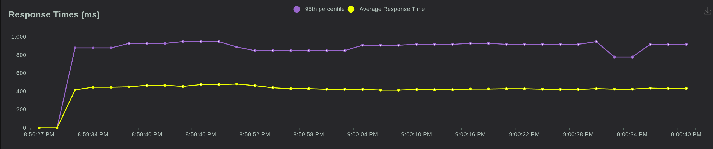
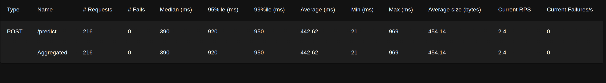
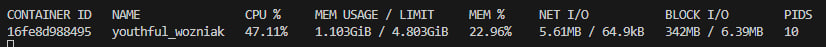

# Discount detector application

This project is a FastAPI application that uses ONNX runtime and transformers.
Below are the instructions to run the application locally in a virtual environment and via Docker.

## Prerequisites

- Python 3.12
- pip
- Docker (optional, for Docker setup)


## Running with Docker

### Note for Windows Users
Docker can run on Windows if you have Docker Desktop installed. Make sure to enable WSL 2 (Windows Subsystem for Linux 2) during the installation for better performance and compatibility.

### Step 1: Build Docker Image

Pull the Docker image from Docker Hub repository:

```shell
docker pull klordoo/discount-detector:latest
```

### Step 2: Run Docker Container
Run the Docker container:

```shell
docker run -d -p 8000:8000 klordoo/discount-detector:latest
```
The application will be available at `http://localhost:8000`.

### Step 3: Access API Documentation

## You can access the automatically generated API documentation at:

- Swagger UI: `http://127.0.0.1:8000/docs`
- ReDoc: `http://127.0.0.1:8000/redoc`

## Additional Note
- Ensure you have the necessary permissions to run Docker commands.


## Running Locally

### Step 1: Clone the Repository
```shell
git clone https://github.com/e0xextazy/lct-2024-ner.git
```
```shell
cd lct-2024-ner
```

### Step 2: Create and Activate Virtual Environment

1. Create a virtual environment:
```shell
python -m venv venv
```
2. Activate the virtual environment:
```shell
source venv/bin/activate
```

### Step 3: Install Dependencies

```shell
pip install -r requirements.txt
```

### Step 4: Download model

```shell
python download_model.py
```

### Step 5: Run the Application

```shell
uvicorn service.main:app
```

#### The application will be available at `http://127.0.0.1:8000`.

### Step 6 (Optional): Access API Documentation

You can access the automatically generated API documentation at:

- **Swagger UI**: [http://127.0.0.1:8000/docs](http://127.0.0.1:8000/docs)
- **ReDoc**: [http://127.0.0.1:8000/redoc](http://127.0.0.1:8000/redoc)

### Step 7 (Optional): Load Testing

You can run load testing using Locust. To start load testing, use the following command:

```shell
locust -f service/tests/locustfile.py --users 1 --spawn-rate 1 --host http://127.0.0.1:8000 --run-time 1m
```
This command will start a load test with 1 user and will run for 1 minute against the host http://127.0.0.1:8000.

After running the command, open your web browser and go to the IP address shown in the terminal (usually http://127.0.0.1:8089), then press the "Start" button to begin the test.

For more details, please refer to the interactive API documentation linked above.

#### Chart of Response Times

<p align="center" width="100%">
    
</p>

#### Table with data

<p align="center" width="100%">
    
</p>

#### Docker stats

<p align="center" width="100%">
    
</p>

## API Documentation

The FastAPI application automatically generates interactive API documentation with Swagger UI and ReDoc.

- **Swagger UI**: [http://127.0.0.1:8000/docs](http://127.0.0.1:8000/docs)
- **ReDoc**: [http://127.0.0.1:8000/redoc](http://127.0.0.1:8000/redoc)

### Endpoints

- **Get Predictions**
  - **URL**: `/predict`
  - **Method**: `POST`
  - **Request Body**:
    ```json
    {
      "text": "привет помните я вам предлагала скидку вот она три процента"
    }
    ```
  - **Response**:
    ```json
    [
      0,
      0,
      0,
      0,
      0,
      1,
      0,
      0,
      2,
      3
    ]
    ```
- **Get UI**
  - **URL**: `/`
  - **Method**: `GET`
  - **Description**: This endpoint returns the content of the `index.html` file located in the `static` directory. It is used to display the main page of your web application.
  - **Response**: HTML content of the `index.html` file.
  
### Prediction Types

The `/predict` endpoint returns a list of prediction types, which can be one of the following values:

- `0` ( "O" )
- `1` ( "B-discount" )
- `2` ( "B-value" )
- `3` ( "I-value" )

For more details, please refer to the interactive API documentation linked above.
